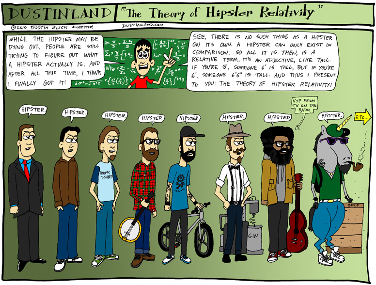
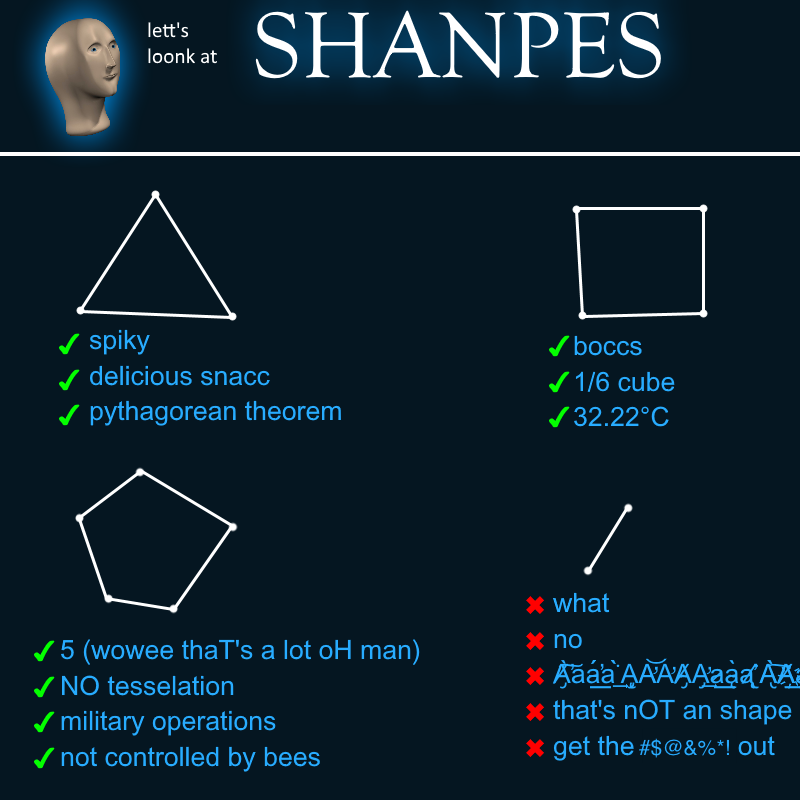
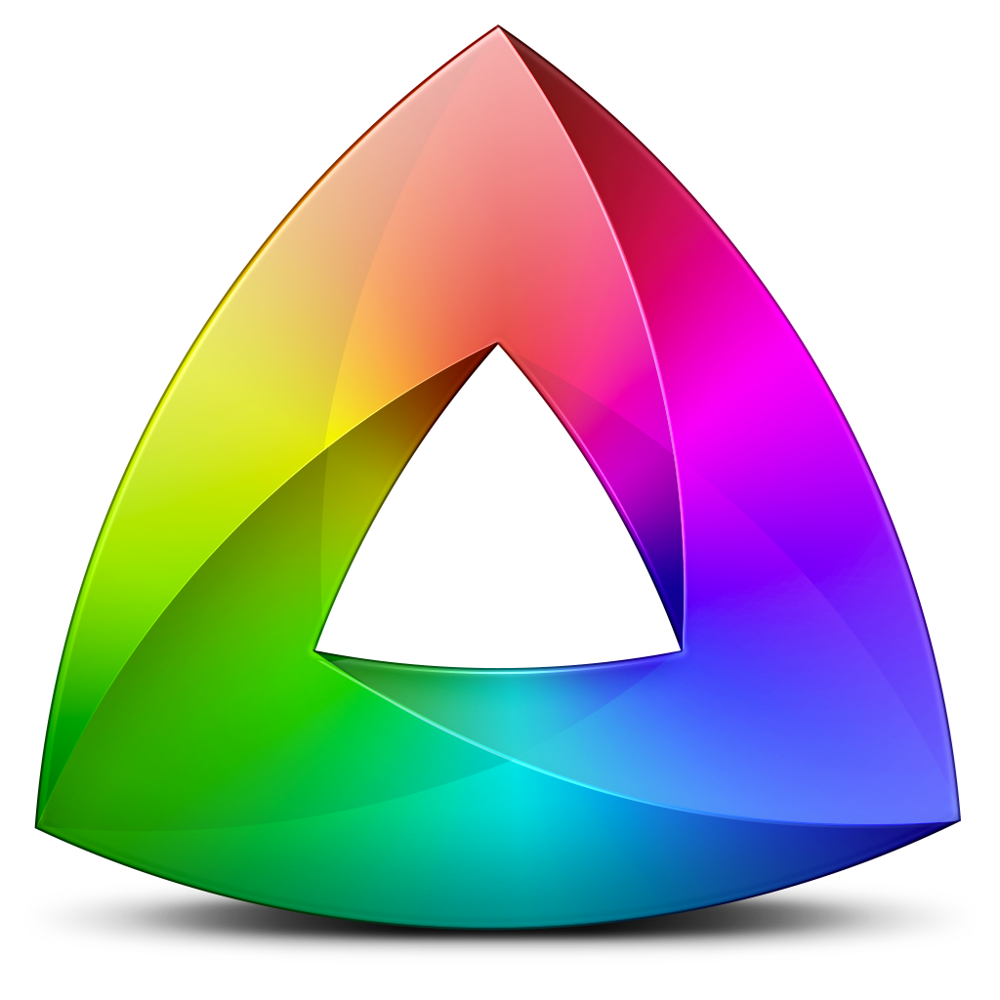
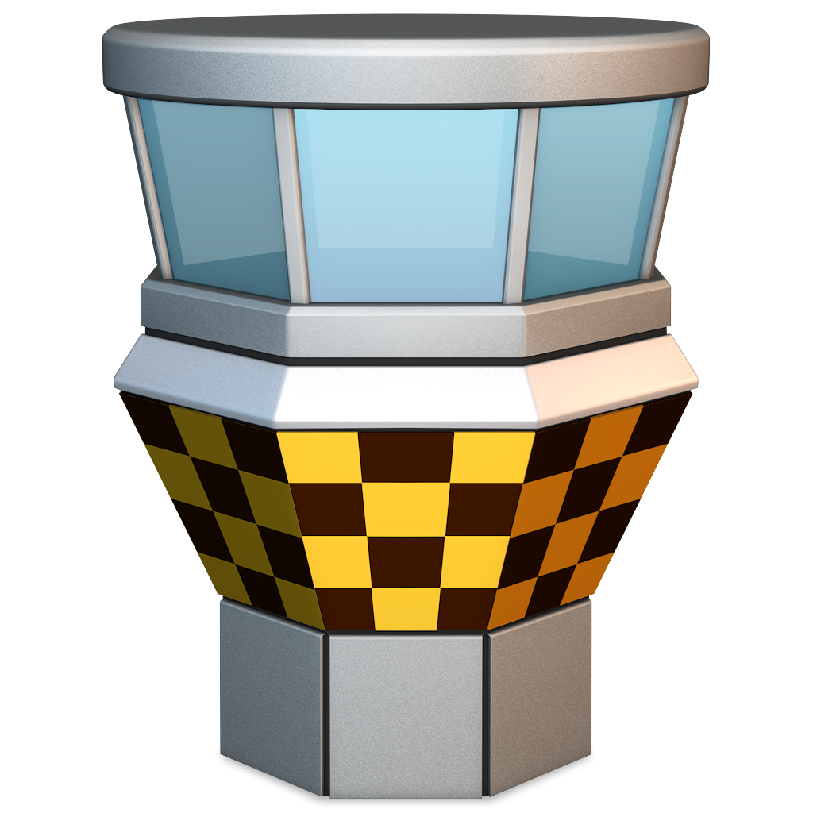
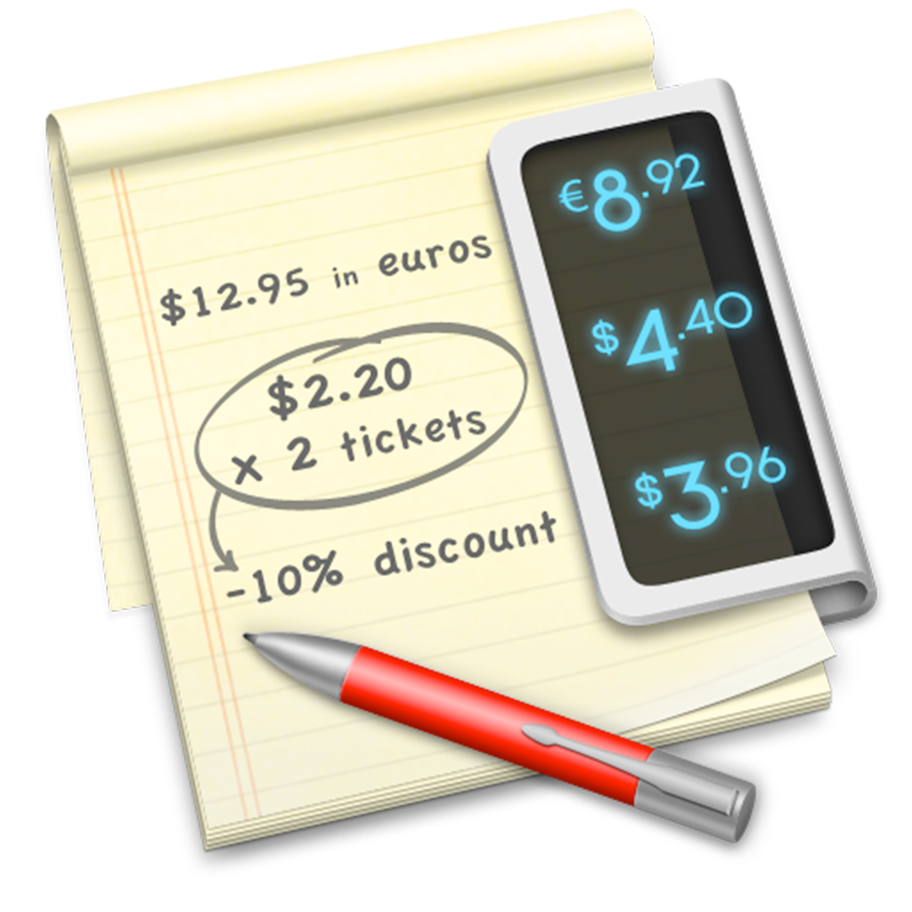
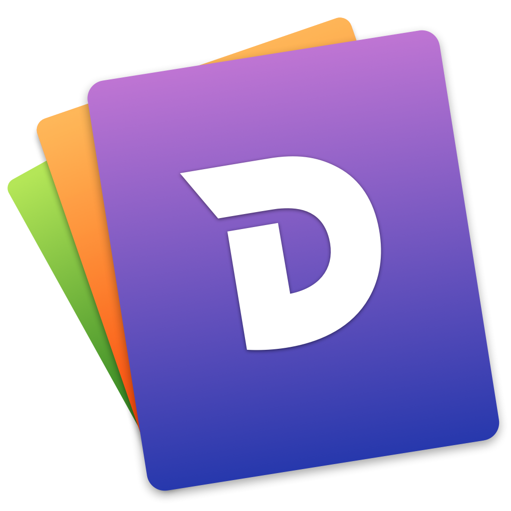
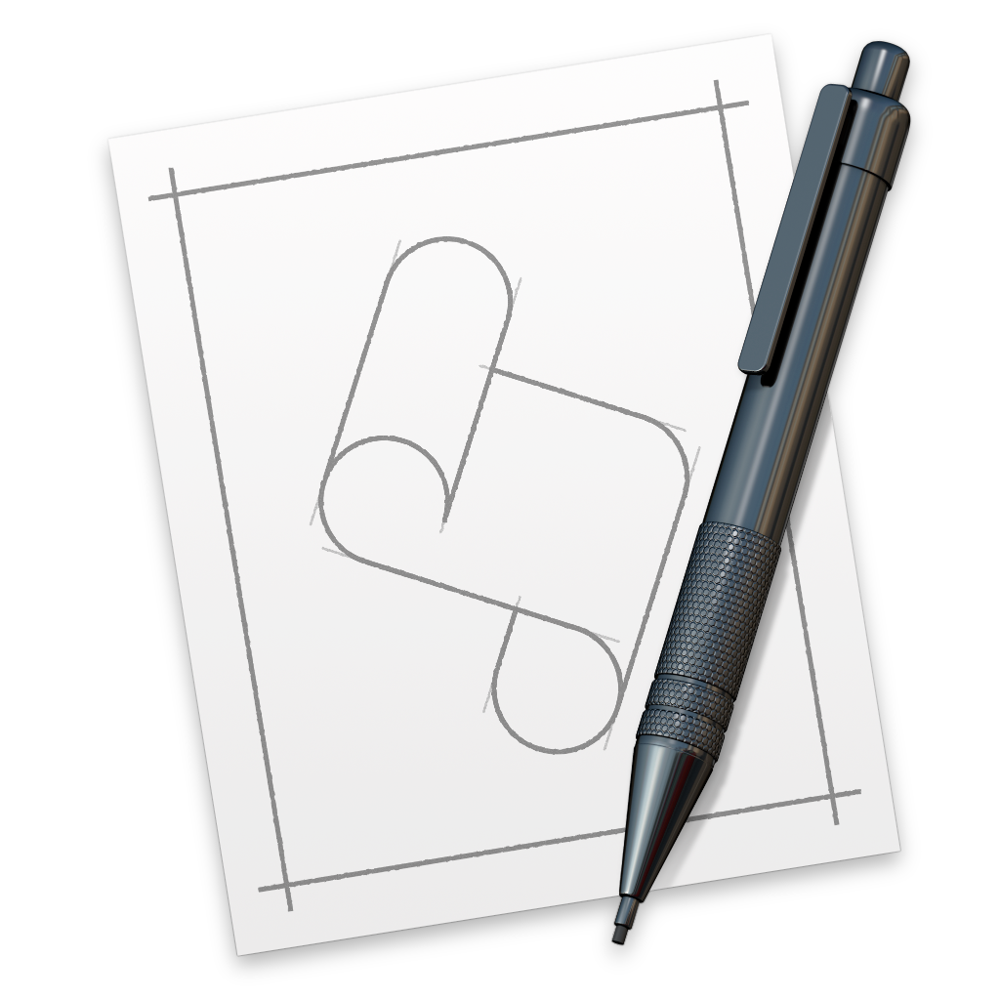
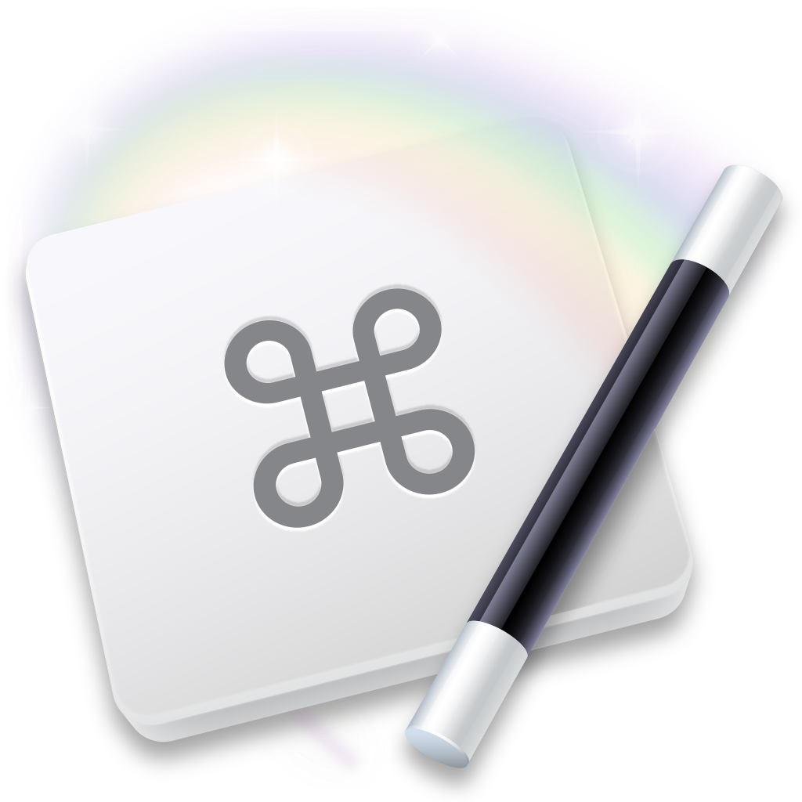

# Hipster Software

The Dank Meme Tools

---

# So what's a hipster?

---

---

# And what's a dank meme?

---

---

---

# I have no #$@&% idea

---

# Why use a tool?

1. To make things impossible possible.
2. It's faster.
2. To reduce effort, make something complex easy (to conserve energy).

---

# Why use paid tools?

* Higher quality GUI tools
* Demos mean low risk purchases
	* No subscriptions
	* No cost of ownership
* Cost is tiny relative to hardware

---

# More

* More likely to be maintained
* The primary cost of software is time invested to learn it
* It's cheap! On a four year upgrade cycle, $400 of software is about $75 a year.

---

# Kaleidoscope

* GUI Diff Tool
* Developed by Black Pixel (originally Sofa)
* $69.99

---

## Advantages of Kaleidoscope over FileMerge?

* Automatic integration with `git` (e.g., `git difftool <branch>`)
* Services integration
* Live updating
* Actively maintained

It has an iOS version.

---

# Kaleidoscope Demo

1. Identifying which change introduced a bug.
2. Services integration

---

# Tower

* GUI Git Client
* Developed by fournova
* $79.00

---

> "Why not just use the command line?"
-- *Way too many people on the internet*

---

## Advantages over `git` from the command line?

* Show visual hierarchy, expand and collapse information
* Perform partial commits
* Simple search

---

# Tower Demo

Izzy's show.

---

# Soulver

* Live Calculator
* Acqualia
* $11.99

---

## Advantages of Soulver over Calculator.app?

* Shows results live
* Saves to a file
* Variables
* Edit equations

---

# Soulver Demo

The cost of software.

---

# Dash

* Documentation Browser
* Kapeli
* $24.99

---

## Advantages of Dash over other documentation?

* Offline
* Consistent interface for various languages (Swift, JavaScript, Java, etc...)
* API Search

---

# Dash Demo

1. Analyzing an API.
2. Show download `.docset`

---

# AppleScript

* Scripting Language with OS Hooks
* Free
* Apple

---

# Why do I want AppleScript?

## Examples

* In Xcode, Open Document Directory in Terminal
* Open a Terminal Window a the Frontmost Finder Window's Location
* Copy the File Path to the Selected File in the Finder
* Copy Markdown Link to the Current Page in Safari to Clipboard

---

# AppleScript Demo

* The Script Menu

---

# Keyboard Maestro

* Macro Utility
* Stairways Software / Peter N Lewis (in business since 1995)
* $36

---

## What's it good for?

* AppleScript Shortcuts
* Type clipboard in the Simulator
* Macros

---

# Shell Tools

---

# `rg` / `ripgrep`

* Command-Line Search Tool
* Open Source & Free (install with Homebrew)
* Free
* `BurntSushi` (Andrew Gallant)
* Written in Rust

---

## Why use `rg` over `grep`?

* Recursive by default
* Automatically ignores version control files
* Smart handling of binaries
* Hierarchical output
* Colors
* Various other interface improvements

---

## Why use `rg` over other search methods?

* You're already there.

---

## History of `ack`-Likes

1. `ack`: written in Perl, introduced core concepts
2. `ag`: written in C, faster than `ack`
3. `rg` written in Rust, properly parsers `.gitignore` files

(Could also be called recursive `grep` tools.)

---

# `rg` Demo

Find a token (`grep --color -R should` vs. `rg should`).

---

# `fzf`

* Fuzzy Finder for the Shell
* Open Source & Free (install with Homebrew)
* `junegunn`
* Written in Go

---

### History of Fuzzy Finders

1. 1996: LaunchBar (NeXTSTEP)
2. 2001: LaunchBar 3 (OS X)
4. 2005: Spotlight
2. 2006: TextMate
3. 2010: Xcode

---

# Why Fuzzy Finders?

> Not all abstract interfaces can outperform a well-designed visual interface. (Just look at the amount of typing airline counter personnel have to do with their steam-powered computers to make a simple change.) LaunchBar is well-designed, quick, and depends on you to form your own abbreviations, sharply reducing the memory burden. I haven't performed or reviewed a stopwatch test, but LaunchBar should be able to outperform a visual interface for complex, repetitive switching sequences by an expert user.
-- *Bruce Tognazzini, AskTog, January, 2004*

Author of the original *The Apple Human Interface Guidelines* in 1978.

---

# `fzf` Demo

Example `git` command

---

# `z` (or `fasd`)

* Jump to directories quickly. Recommend using `fasd` because it's installable with Homebrew.
* Open Source & Free (install with Homebrew)
* Written by `clvv`
* Written in Bash?
* `z` integrates with `fzf`

---

# `z` Demo

* Jump between directories.